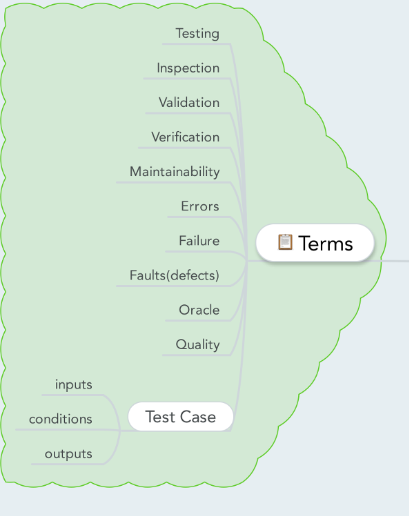

# Terms

- [Back to index](README.md)

## Anki

- [Anki SoftwareTesting-terms (apkg file)](anki/SoftwareTesting-Terms.apkg)

## Mindmap

## Videos

- How To write a Test Case <https://www.youtube.com/watch?v=BBmA5Qp6Ghk>

## Definitions

> **Testing** is generally described as a group of procedures carried out to evaluate some aspect of a piece of software.

> **Testing(2)** can be described as a process used for revealing defects in software, and for establishing that the software has attained a specified degree of quality with respect to selected attributes.

> **Inspection** is the process of manual scrutiny of some software artifact with the purpose of finding faults or demonstrating their absence

> **Validation** is the process of evaluating a software system or component during, or at the end of, the development cycle in order to determine whether it satisfies specified requirements.

> **Verification** is the process of evaluating a software system or component to determine whether the products of a given development phase satisfy the conditions imposed at the start of that phase.

> **Maintainability**: The effort needed to make changes in the software.

> **Errors**: an error is a mistake, misconception, or misunderstanding on the part of a software developer.

> **Failures**: A failure is the inability of a software system or component to perform its required functions within specified performance requirements.

> **Faults (defects)**: A fault (defect) is introduced into the software as the result of an error. It is an anomaly in the software that may cause it to behave incorrectly, and not according to its specification. They are sometimes referred to as **bugs**.

Note that a fault in the code does not always produce an failure. A fault may be hidden in the code unnoticed for a long time. But when the faulty code is run a failure have occured.

Software that easily reveals its faults as failures is said to be more testable. From the testers point-of-view this is a desirable software attribute.

> **Test Oracle**: A test oracle is a document, or piece of software that allows testers to determine wheter a test has been passed or failed.

A program, or a document that produces or specifies the expected outcome of a test, can serve as an oracle.

> **Software Quality** Quality software is reasonably bug or defect free, delivered on time and within budget, meets requirements and/or expectations, and is maintainable.

> **Software Quality(2)**: Quality relates to the degree to which a system, system component, or process meets specified requirements and customer and user needs or expectations.

In order to determine the quality we use a quality metrics.

ISO 8402-1986 standard defines quality as  “*the totality of features and characteristics of a product or service that bears its ability to satisfy stated or implied needs.*"

> **Test Cases**: Contains the inputs, conditions and expected output. 

More specific, a **test case** should contain the following information:

1. A set of test **inputs**. 

2. Execution **conditions**. The conditions for running the test, for example, a certain state of a database, or a configuration of a hardware device.

3. Expected **outputs**. These are the specified results to be produced by the code under test.

--------

Below are some **bonus** terms that are not mentioned in the mindmap.

> **Test**: A test is a group of related test cases, or a group of related test cases and test procedures (steps needed to carry out a test)

A group of related tests is sometimes referred to as a *test set*. A group of of related tests that are associated with a *database*, and are usually run together, is sometimes reffered to as a *test suite*. 

> **Test Bed**: A test bed is an environment that contains all the hardware and software needed to test a software component or a software system.

This includes the entire testing environment, for example: simulators, emulators, memory checkers, hardware probes, software tools, and all other items needed to support execution of the tests.

> **Metric**: A metric is a quantitative measure of the degree to which a system, system component, or process possesses a given attribute.

> **Correctness**: The degree to which the system performs its intended function.

> **Reliability**: The degree to which the software is expected to perform its required functions under stated conditions for a stated period of time.

> **Usability**: Relates to the degree of effort needed to learn, operate, prepare input and interpret output of the software.

> **Integrity**: Relates to the systems ability to withstand both intentional and accidental attacts.

> **Portability**: Relates to the ability of the software to be transferred from one environment to another.

> **Interoperability**: The effort needed to link or couple on system to another.

> **Software Quality Assurance Group** (SQA): Is a group of people which serve as the customers representative and advocate. Their responsibility is to look after the customers interests. 

> **Review**: A review is a group meeting whose purpose is to evaluate a software artifact or a set of software artifacts.

